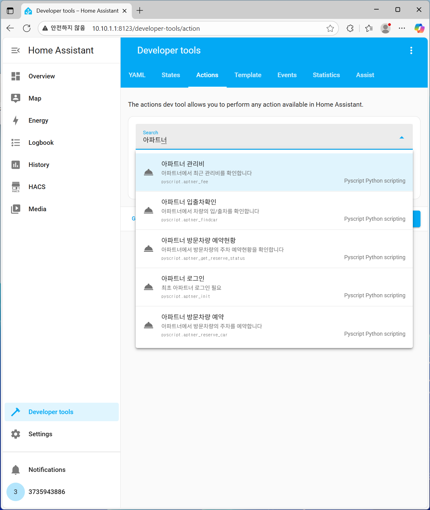
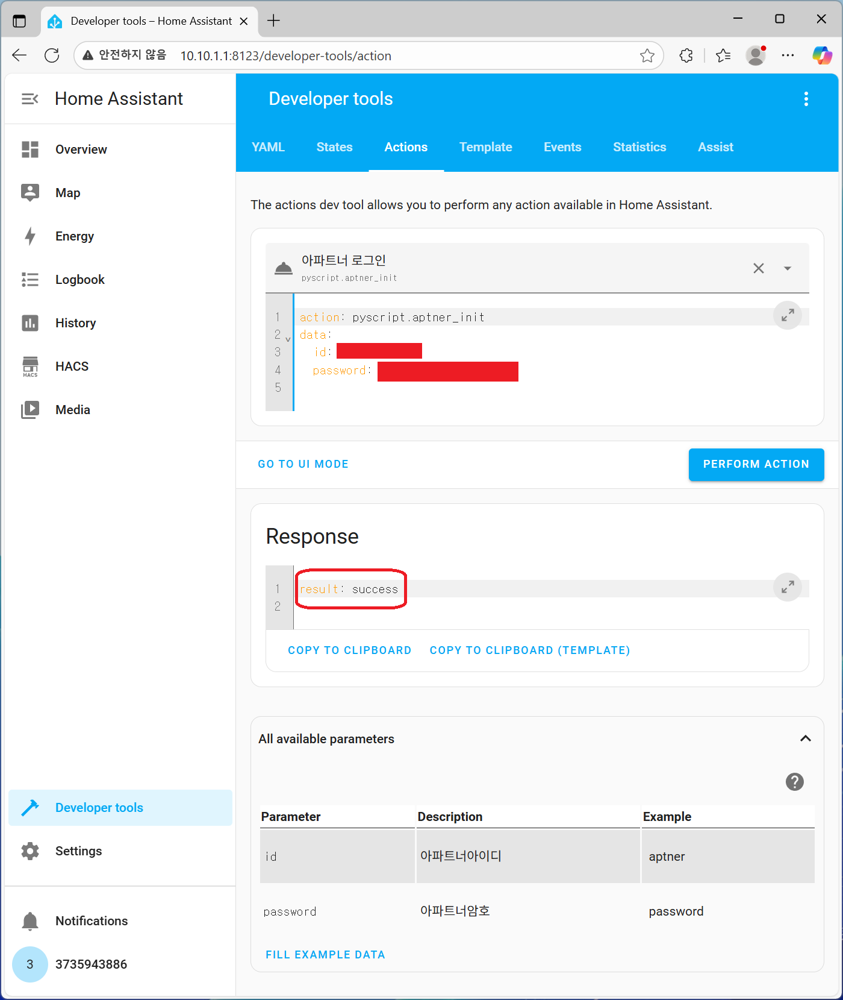
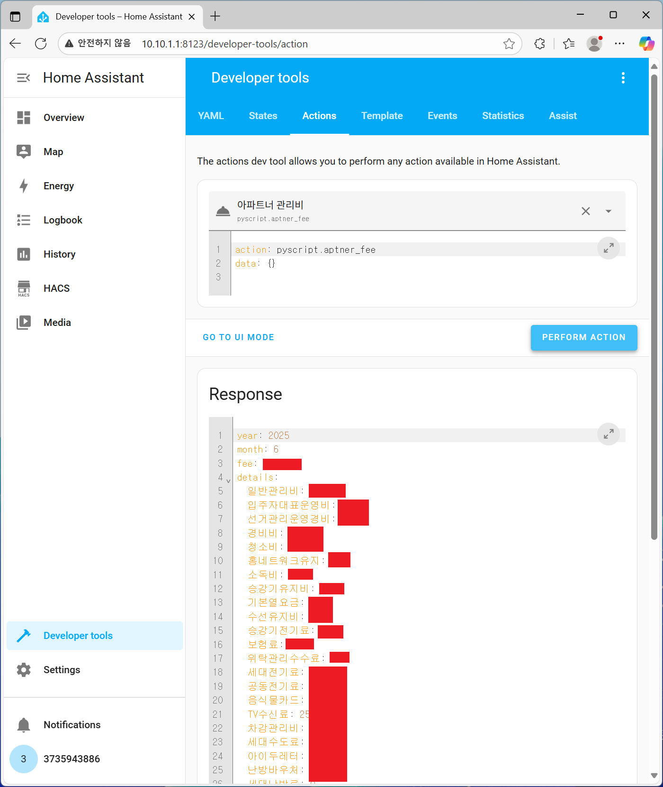
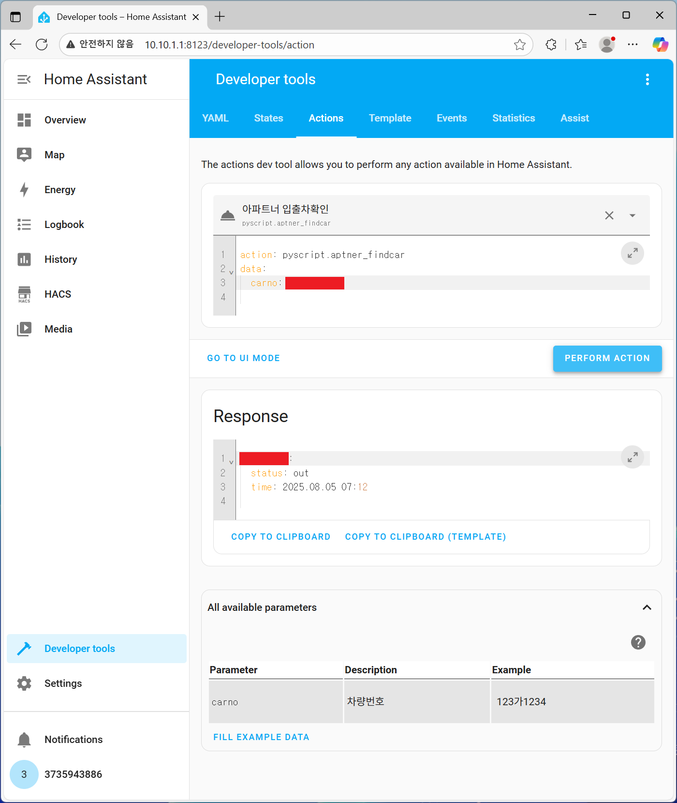
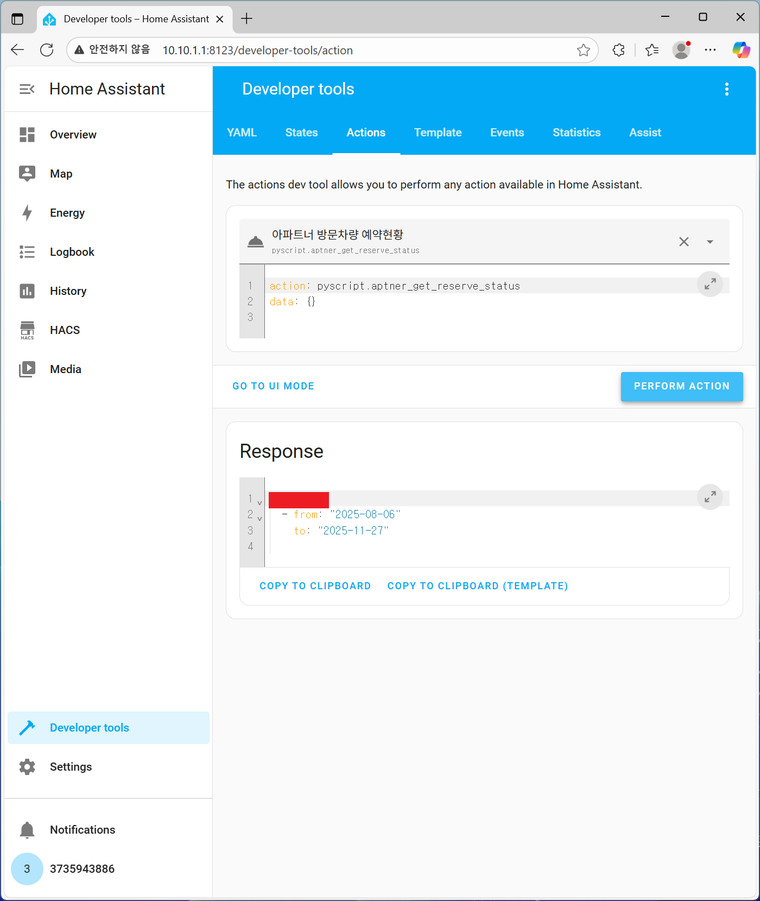
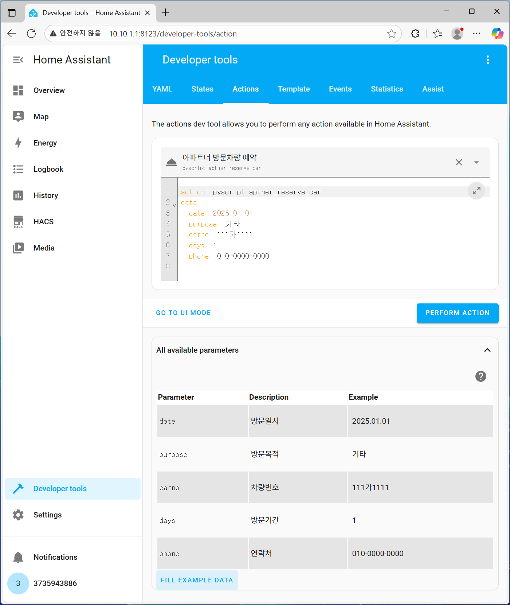

# Home Assistant Pyscript for Aptner

홈어시스턴트의 Pyscript 환경에서 대한민국 아파트 생활지원 앱 '아파트너(Aptner)'의 주요 기능을 연동하기 위한 스크립트입니다.
이 스크립트를 통해 아파트너 앱에서 제공하는 관리비 내역, 차량 입/출차 기록, 방문차량 예약 등의 기능을 Home Assistant 자동화에 활용할 수 있습니다.

## ✨ 주요 기능

  * **관리비 조회**: 최근 부과된 관리비 총액과 상세 내역을 가져옵니다.
  * **차량 입/출차 확인**: 등록된 차량의 최근 입차 또는 출차 상태와 시간을 확인합니다.
  * **방문차량 예약 현황**: 예약된 방문차량의 목록과 방문 기간을 조회합니다.
  * **방문차량 예약/관리**: 새로운 방문차량을 예약합니다.

## ⚙️ 사전 요구사항

  - **Home Assistant**: 이 코드는 Home Assistant 환경에서 동작합니다.
  - **Pyscript**: `Pyscript` 통합 구성요소를 설치하고 설정해야 합니다. 자세한 내용은 [Pyscript](https://hacs-pyscript.readthedocs.io/en/latest/installation.html)를 참고하세요.
  - **아파트너 계정**: 아파트너 앱에서 사용하는 아이디와 비밀번호가 필요합니다.

## 📥 설치 방법

`aptner_pyscript.py`를 Home Assistant `<config>/pyscript` 폴더에 저장합니다. 5개의 액션이 자동으로 등록 됩니다.

 
 

## 🚀 사용 방법

### 1\. 초기 로그인 (필수)

스크립트의 모든 기능을 사용하기 전에 반드시 아파트너 계정으로 로그인해야 합니다.

  * **개발자 도구** \> **액션**으로 이동합니다.
  * 액션 검색창에서 `아파트너 로그인`을 선택합니다.
  * `id`와 `password` 필드에 아파트너 계정 정보를 입력하고 **실행** 버튼을 누릅니다.
  * 성공적으로 호출되면 이후부터 다른 액션들을 사용할 수 있습니다.

> 팁: 이 액션은 Home Assistant가 시작될 때마다 실행되는 자동화에 등록해두면 편리합니다.
 

### 2\. 제공되는 액션

#### 가. 아파트너 관리비 (`pyscript.aptner_fee`)

최근 관리비 내역을 조회합니다.
  
  * **파라미터**: 없음
  * **반환값**: 최근 관리비 세부내역
    

> 팁: 이 액션은 관리비가 부과되는 날 전후로 일정시간 간격 자동으로 호출해서 결과를 attribute로 저장하는 관리비 확인용 센서를 만들면 편리합니다.
 

#### 나. 아파트너 입출차확인 (`pyscript.aptner_findcar`)

차량의 입/출차 상태를 확인합니다.

  * **파라미터**:
      * `carno` (선택 사항): 특정 차량번호를 지정합니다. 지정하지 않으면 모든 등록 차량의 마지막 상태를 반환합니다.
  * **반환값**: 차량의 입출차 현황
    

 
 

#### 다. 아파트너 방문차량 예약현황 (`pyscript.aptner_get_reserve_status`)

현재 예약된 방문차량 목록을 조회합니다.

  * **파라미터**: 없음
  * **반환값**: 연속된 예약일은 하나의 기간으로 묶어서 표시됩니다.
    

 
 

#### 라. 아파트너 방문차량 예약 (`pyscript.aptner_reserve_car`)

방문차량 주차를 예약합니다.

  * **파라미터**:
      * `date` (필수): 방문 시작일 (예: `2025.01.01`)
      * `purpose` (필수): 방문 목적 (예: `기타`)
      * `carno` (필수): 차량번호 (예: `111가1111`)
      * `days` (필수): 방문 기간(일) (예: `1`)
      * `phone` (필수): 운전자 연락처 (예: `010-0000-0000`)

